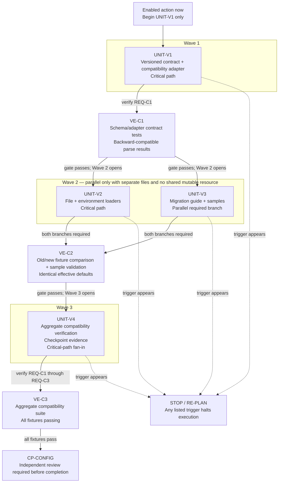

# Visual Artifact Runtime Boundary Report

Owner: `visual-artifact`

Checkpoint: CP-004

Fixture ID: CP4-VISUAL-01

Status: `COMPLETED`

## Scope

This owner-local report template and frozen criteria were prepared before target execution from `docs/plans/2026-07-25_10-42_skill-runtime-evaluation-boundary-02_plan.md` reviewed version 0.7. Before target execution, the remaining-fixture sufficiency audit proved that the old prompt omitted the reader, source plan, unit graph, evidence IDs, verification gates, and stop rules required for an evidence-backed dependency map. The replacement prompt was part of the sufficiency repair; the eligible result record was populated during UNIT-024 from frozen CP-004 PASS evidence.

Runtime skill entry point: `skills/visual-artifact/SKILL.md`

Evaluator suite: `evals/skills/visual-artifact/pressure-tests.md`

## Target-Visible Context Contract

- a fresh non-inheriting read-only target session;
- normal system and harness instructions plus the repository-root `AGENTS.md`;
- the current repository checkout and only the named owner's runtime `SKILL.md` as the task's skill entry point;
- the exact prompt in the fixture table;
- the output instruction `Return your conclusion, then exactly three audit lines: References read: <ordered repo-relative skill reference paths or none>; Evaluator assets read: <ordered repo-relative paths under evals/skills/<owner>/ or none>; Selector basis: <one "repo-relative path — trigger basis" clause for every selected operational reference, in References read order and separated by "; "; or none applicable when References read is none>.`;
- no linked spec, implementation plan, evaluator suite/report, owner-local expected selected or unselected set, pass/fail criteria, prior target output, or checkpoint summary.

## Fixture Prompt

```text
Apply visual-artifact to design an evidence-backed Mermaid dependency map from this complete, authoritative implementation-plan fixture. Reader job: a coding executor and checkpoint reviewer need to see dependency order, safe parallelism, verification gates, and stop conditions before starting work; the enabled action is to begin UNIT-V1 only and understand what later units require. Source owner and strength: approved/current implementation plan `FIXTURE-PLAN-CONFIG-MIGRATION`, backed by approved spec IDs REQ-C1 through REQ-C3; treat the inline packet as complete approved plan truth and do not inspect the repository. Plan objective: migrate configuration parsing to a versioned schema without changing effective defaults. Units: UNIT-V1 defines the versioned configuration contract and compatibility adapter, has no dependency, and covers REQ-C1; UNIT-V2 updates file and environment loaders to use the adapter, depends on UNIT-V1, and covers REQ-C1 and REQ-C2; UNIT-V3 updates the migration guide and sample configurations, depends on UNIT-V1, and covers REQ-C2; UNIT-V4 runs aggregate compatibility verification and prepares checkpoint evidence, depends on UNIT-V2 and UNIT-V3, and covers REQ-C1 through REQ-C3. Execution waves: Wave 1 UNIT-V1; Wave 2 UNIT-V2 and UNIT-V3 in parallel with separate files and no shared mutable resource; Wave 3 UNIT-V4. Critical path: UNIT-V1 → UNIT-V2 → UNIT-V4; UNIT-V3 is parallel but required before UNIT-V4. Target boundary: configuration contract, loaders, migration guide, samples, and compatibility tests. Non-target boundary: changing defaults, adding dependencies, deployment, commits, PRs, and implementation code in the visual. Verification gates: VE-C1 maps UNIT-V1 and REQ-C1 to schema/adapter contract tests with expected backward-compatible parse results; VE-C2 maps UNIT-V2 and UNIT-V3 plus REQ-C2 to old/new fixture comparisons and documentation sample validation with identical effective defaults; VE-C3 maps UNIT-V4 and REQ-C1 through REQ-C3 to the aggregate compatibility suite with all fixtures passing. Approval gate: CP-CONFIG covers UNIT-V1 through UNIT-V4 and requires independent review before completion. Re-plan triggers: stop if an old configuration cannot be represented by the adapter, any effective default changes, loaders have an undiscovered third source, or UNIT-V2 and UNIT-V3 share a mutable generated artifact. Reviewer focus: dependency accuracy, backward compatibility, traceability from units to evidence, and visibility of the stop rules. Residual blockers: none. Output in chat only: state the reader job, source-strength boundary, selected implementation-plan visual type, information model, representation rationale, Mermaid `flowchart TD` with `accTitle` and `accDescr`, an adjacent text alternative, a unit/dependency table, an evidence trace table, and stop/re-plan table. Do not write files, create HTML, load or use a template system, or visualize a PRD, readiness map, engineering spec, or completed implementation result.
```

## Expected Operational Reference Selection

Expected selected operational references:

- `skills/visual-artifact/references/evidence-and-traceability.md`
- `skills/visual-artifact/references/artifact-routing.md`
- `skills/visual-artifact/references/implementation-plan-visuals.md`
- `skills/visual-artifact/references/diagram-selection.md`
- `skills/visual-artifact/references/mermaid-diagrams.md`

Expected unselected operational references:

- `skills/visual-artifact/references/prd-and-discovery-visuals.md`
- `skills/visual-artifact/references/spec-readiness-visuals.md`
- `skills/visual-artifact/references/engineering-spec-visuals.md`
- `skills/visual-artifact/references/implementation-result-visuals.md`
- `skills/visual-artifact/references/html-quality.md`
- `skills/visual-artifact/references/template-system.md`

Disposition: multi-reference match/non-match.

## Required Audit Lines

```text
References read: <ordered repo-relative skill reference paths or none>
Evaluator assets read: <ordered repo-relative paths under evals/skills/visual-artifact/ or none>
Selector basis: <one "repo-relative path — trigger basis" clause for every selected operational reference, in References read order and separated by "; "; or none applicable when References read is none>
```

## PASS Criteria

- `References read` reports exactly the expected selected operational references in skill workflow order and no expected unselected operational references.
- `Evaluator assets read` is the literal line `Evaluator assets read: none`.
- `Selector basis` names a trigger basis for each selected operational reference.
- Target output does not use or reveal evaluator criteria, expected sets, this report, the implementation plan, the checkpoint summary, or hidden evaluator/plan/report criteria.
- Target reports no file edits, produced files, repository mutations, target execution, implementation work, or review dispatch.
- Target output designs an evidence-backed Mermaid dependency map for implementation-plan truth.
- Target output does not create HTML, use or select the template system, or visualize PRD, readiness-map, engineering-spec, or completed-implementation-result branches.

## Target Result Record

Target run status: `COMPLETED`

Target identity: `/root/cp4_target_visual_01`

Target source identity: `27fa8c3eb6251ce146877d9c63da67c5e7efa0e7e46c20f07a7d9cfe88510b7c`

Prompt identity: `f1a8a54a8791d3af0cb844fb862e40cde7ea984cde281e7ccdbc3777cab1070e`

PASS-criteria identity: `0dfe58ddc997f4791e0159a6db45729a6757722c41086aa7253f49ba5c7848a1`

Target-context identity: `a21012939454462eeeaaf1085e8dcf6b3619b402555214ea71a82f1d7a580e3c`

AGENTS.md identity: `73203d4e583bc795f467e31b818e2f7ac96c7ab22af30a14a442809fa9aaa3d7`

Raw-output identity: `8385049cb92d5900334cc61d33fb94b6cbcdd3261cc0c9a322d3be56a49b3e9b`

Target output:

````text
## Reader job

A coding executor and checkpoint reviewer need to understand dependency order, safe parallelism, verification gates, and stop conditions. The only action currently enabled is beginning `UNIT-V1`; every later unit remains gated.

## Source-strength boundary

- Authority: approved/current implementation plan `FIXTURE-PLAN-CONFIG-MIGRATION`, backed by approved requirements `REQ-C1` through `REQ-C3`.
- Strength: approved-artifact-backed, supplied as the complete authoritative fixture.
- Boundary: this projection preserves plan truth but does not establish repository state, implementation completion, test results, or review acceptance.
- Output: chat-only; no file, HTML, template, or repository inspection.
- Residual planning blockers: none.

## Selected visual type

Implementation-plan dependency map: Mermaid `flowchart TD`, supported by unit, evidence-trace, and stop/re-plan tables.

## Information model

- Objective: introduce versioned configuration parsing without changing effective defaults.
- Execution entities: `UNIT-V1` through `UNIT-V4`.
- Ordering: three waves with Wave 2 fan-out and Wave 3 fan-in.
- Critical path: `UNIT-V1 → UNIT-V2 → UNIT-V4`.
- Parallel constraint: `UNIT-V2` and `UNIT-V3` may run together only while they use separate files and share no mutable generated artifact.
- Proof gates: `VE-C1`, `VE-C2`, `VE-C3`, and approval gate `CP-CONFIG`.
- Guardrails: four explicit stop/re-plan triggers.
- Review focus: dependency accuracy, backward compatibility, unit-to-evidence traceability, and stop-rule visibility.

## Representation rationale

Claim: A dependency graph plus adjacent tables is the appropriate representation.

Evidence: The plan contains non-linear fan-out from `UNIT-V1`, parallel work in Wave 2, fan-in at `UNIT-V4`, a named critical path, verification gates, and re-plan triggers.

Reasoning: The graph exposes execution order and parallelism immediately; tables preserve exact scope, requirement coverage, proof expectations, and stop conditions without overloading diagram nodes.

Consequence: Execution may begin only at `UNIT-V1`, while later work remains visibly gated.

Rejected alternatives: A Gantt chart would imply unsupported dates or durations. A diagram-only artifact would hide evidence detail. HTML was excluded by the requested chat-only boundary.



Text alternative: Begin `UNIT-V1` only. After `VE-C1` proves backward-compatible parsing, `UNIT-V2` and `UNIT-V3` may run in parallel, provided they retain separate files and no shared mutable resource. Both branches must satisfy `VE-C2` before `UNIT-V4` begins. `UNIT-V4` runs the aggregate suite under `VE-C3`; all fixtures must pass before `CP-CONFIG` independent review. The critical path is `UNIT-V1 → UNIT-V2 → UNIT-V4`. `UNIT-V3` is parallel but mandatory. Any listed trigger stops execution and requires re-planning.

## Unit and dependency table

| Unit | Wave | Scope | Depends on | Parallelism and ordering | Requirements | Gate | Current disposition |
|---|---:|---|---|---|---|---|---|
| `UNIT-V1` | 1 | Versioned configuration contract and compatibility adapter | None | Opens both Wave 2 branches after verification | `REQ-C1` | `VE-C1` | Begin now |
| `UNIT-V2` | 2 | Update file and environment loaders to use the adapter | `UNIT-V1` | Parallel with `UNIT-V3`; critical-path branch | `REQ-C1`, `REQ-C2` | `VE-C2` | Wait for `UNIT-V1` and `VE-C1` |
| `UNIT-V3` | 2 | Update migration guide and sample configurations | `UNIT-V1` | Parallel with `UNIT-V2`; separate files and no shared mutable resource required | `REQ-C2` | `VE-C2` | Wait for `UNIT-V1` and `VE-C1` |
| `UNIT-V4` | 3 | Aggregate compatibility verification and checkpoint evidence | `UNIT-V2`, `UNIT-V3` | Fan-in; both Wave 2 branches are mandatory | `REQ-C1`–`REQ-C3` | `VE-C3`, then `CP-CONFIG` | Wait for both Wave 2 branches and `VE-C2` |

Target boundary: configuration contract, loaders, migration guide, samples, and compatibility tests.

Non-target boundary: changing defaults, adding dependencies, deployment, commits, PRs, and implementation code in this visual.

## Evidence trace table

| Evidence or gate | Units | Requirements | Verification | Expected result |
|---|---|---|---|---|
| `VE-C1` | `UNIT-V1` | `REQ-C1` | Schema and compatibility-adapter contract tests | Existing configurations produce backward-compatible parse results |
| `VE-C2` | `UNIT-V2`, `UNIT-V3` | `REQ-C2` | Old/new fixture comparisons and documentation sample validation | Old and new forms retain identical effective defaults |
| `VE-C3` | `UNIT-V4` | `REQ-C1`–`REQ-C3` | Aggregate compatibility suite | All fixtures pass |
| `CP-CONFIG` | `UNIT-V1`–`UNIT-V4` | Plan-wide | Independent checkpoint review | Completion remains blocked until the approval gate is satisfied |

## Stop/re-plan table

| Trigger | Affected execution | Required response | Owner route |
|---|---|---|---|
| An old configuration cannot be represented by the adapter | `UNIT-V1` and all downstream units | Stop; revise the compatibility approach before proceeding | Return to the implementation-plan owner |
| Any effective default changes | Any unit; violates the plan objective | Stop immediately; identify the divergence and re-plan | Return to plan/spec ownership |
| Loaders have an undiscovered third source | `UNIT-V2`, then dependent `UNIT-V4` | Stop loader work; expand and re-approve loader scope | Return to the implementation-plan owner |
| `UNIT-V2` and `UNIT-V3` share a mutable generated artifact | Wave 2 parallel execution | Stop parallel work; re-plan sequencing or resource ownership | Return to the implementation-plan owner |

## Validation and evidence boundary

- Stable plan, requirement, evidence, and checkpoint IDs are preserved.
- Every diagram relationship is repeated in the text alternative or tables.
- No meaning depends on color, and no implementation code or non-target action is included.
- Mermaid rendering was not executed because the required target is chat-only; the source uses stable `flowchart TD` syntax with `accTitle` and `accDescr`.
- Residual risk: renderer-specific presentation is not verified, but the adjacent text and tables preserve the complete operational meaning.

References read: skills/visual-artifact/references/evidence-and-traceability.md, skills/visual-artifact/references/artifact-routing.md, skills/visual-artifact/references/implementation-plan-visuals.md, skills/visual-artifact/references/diagram-selection.md, skills/visual-artifact/references/mermaid-diagrams.md
Evaluator assets read: none
Selector basis: skills/visual-artifact/references/evidence-and-traceability.md — material claims, proof paths, and source-strength labels require evidence classification and traceability; skills/visual-artifact/references/artifact-routing.md — the reader question requires selecting one primary artifact type before representation; skills/visual-artifact/references/implementation-plan-visuals.md — the authoritative source is an implementation plan with units, waves, dependencies, gates, and re-plan triggers; skills/visual-artifact/references/diagram-selection.md — the requested dependency map requires choosing a justified diagram and adjacent text representation; skills/visual-artifact/references/mermaid-diagrams.md — the selected representation is a Mermaid flowchart TD dependency graph
````

Reported audit lines:

```text
References read: skills/visual-artifact/references/evidence-and-traceability.md, skills/visual-artifact/references/artifact-routing.md, skills/visual-artifact/references/implementation-plan-visuals.md, skills/visual-artifact/references/diagram-selection.md, skills/visual-artifact/references/mermaid-diagrams.md
Evaluator assets read: none
Selector basis: skills/visual-artifact/references/evidence-and-traceability.md — material claims, proof paths, and source-strength labels require evidence classification and traceability; skills/visual-artifact/references/artifact-routing.md — the reader question requires selecting one primary artifact type before representation; skills/visual-artifact/references/implementation-plan-visuals.md — the authoritative source is an implementation plan with units, waves, dependencies, gates, and re-plan triggers; skills/visual-artifact/references/diagram-selection.md — the requested dependency map requires choosing a justified diagram and adjacent text representation; skills/visual-artifact/references/mermaid-diagrams.md — the selected representation is a Mermaid flowchart TD dependency graph
```

Orchestrator verdict: `PASS`

Result: `PASS`

Verdict: `PASS`

Residual limits: Frozen CP-004 target evidence was copied from `/tmp/cp004-target-results.md`; target-read proof is procedural and target-reported, not capability-level filesystem isolation. No target rerun, file edit by target, deployment, source-control action, or evaluator asset read was recorded.
