# codebase-search

## When to Use

Use this skill for questions like:

- "How does authentication work?"
- "Where is this implemented?"
- "Who calls this function?"
- "What files handle this subsystem?"
- "Does this pattern already exist?"
- "What breaks if I change this symbol?"
- "Which search tool should I start with here?"

Do **not** use this skill for:

- writing or editing code without first locating and verifying the relevant code paths
- purely operational `codeindex` questions once you already know `codeindex` is the right tool — use `codeindex`

## Overview

This skill routes codebase-understanding work to the right search and code-intelligence tool.

Core principle:

**discovery and proof are different jobs**

- use high-recall tools to find candidates quickly
- use high-precision tools to verify exact definitions, usages, and impact
- read actual source before making precise claims about behavior

**REQUIRED SUB-SKILL:** When this skill decides to use `codeindex`, load the project skill `codeindex` before running any `codeindex` command. Every `codeindex` command must use a `3600000` ms timeout (1 hour). Follow the `codeindex` skill for config resolution, freshness, command selection, output modes, and safety rules.

## Tool Selection Flow

```dot
digraph codebase_search {
    rankdir=LR;
    fileq [label="Need filename or path only?", shape=diamond];
    structq [label="Need syntax or AST shape?", shape=diamond];
    symbolq [label="Need exact symbol truth or refs?", shape=diamond];
    conceptq [label="Need concept / feature orientation?", shape=diamond];
    glob [label="Use Glob", shape=box];
    ast [label="Use ast-grep", shape=box];
    lsp [label="Use LSP or Grep", shape=box];
    codeindex [label="Use codeindex\nthen verify", shape=box];
    grep [label="Use Grep + source reads", shape=box];

    fileq -> glob [label="yes"];
    fileq -> structq [label="no"];
    structq -> ast [label="yes"];
    structq -> symbolq [label="no"];
    symbolq -> lsp [label="yes"];
    symbolq -> conceptq [label="no"];
    conceptq -> codeindex [label="yes"];
    conceptq -> grep [label="no / fallback"];
}
```

## Search Layers

Use this progression when the task is not trivial:

1. **Discovery**
   - Find likely files, symbols, and entry points.
   - Best tools: `codeindex`, `Glob`, `Grep`

2. **Narrowing**
   - Once you know what you are looking for, switch to the most precise tool.
   - Best tools: `ast-grep`, `Grep`, `LSP`

3. **Verification**
   - Before claiming exhaustive usage, exact impact, or refactor safety, verify.
   - Best tools: `LSP findReferences`, `Grep`

4. **Source confirmation**
   - Read the actual implementation files before making precise behavior claims.

## Tool Routing Table

| Task shape                           | Start with                 | Why                                 | Then do                                                                 |
| ------------------------------------ | -------------------------- | ----------------------------------- | ----------------------------------------------------------------------- |
| Concept / feature question           | `codeindex` when available | Best discovery/orientation layer    | Read source, then verify with `Grep`/`LSP` if claims must be exhaustive |
| Known symbol, need blast radius      | `codeindex impact`         | Fast caller/callee context          | Verify with `LSP` or `Grep` when exactness matters                      |
| Exact string, config key, error text | `Grep`                     | Exhaustive text match               | Read the hits                                                           |
| Filename or path pattern             | `Glob`                     | Fastest file discovery              | Read candidate files                                                    |
| Structural code pattern              | `ast-grep`                 | Matches syntax shape, not just text | Read hits; use `Grep` for exhaustive text if needed                     |
| Exact definition, signature, refs    | `LSP`                      | Type-aware source of truth          | Read source; use `Grep` if index freshness is doubtful                  |

## When `codeindex` is the Right First Move

Start with `codeindex` when:

- you know the behavior or concept, but not the symbol or file name
- the user asks how a feature works across multiple files
- you need quick orientation in an unfamiliar repository
- you want a likely starting point before deeper verification

Examples:

- "How does login work?"
- "Where does this app create the client?"
- "What handles retries in this codebase?"

When you choose `codeindex`, load the `codeindex` skill before running any `codeindex` command, and use a `3600000` ms timeout (1 hour) for that command.

## When `codeindex` Is Not Enough

`codeindex` is strong for discovery and impact, but it is not proof by itself.

Escalate beyond `codeindex` when:

- you must prove there are no other usages
- exact symbol references matter more than conceptual matches
- you need syntax-aware matching rather than semantic similarity
- the repository is unindexed, stale, or clearly missing expected results

Fallback order when `codeindex` is unavailable or insufficient:

1. `Glob` for file discovery
2. `Grep` for exact text discovery
3. `ast-grep` for structural search
4. `LSP` for exact symbol truth

## Use Each Tool for What It Is Good At

### `codeindex`

Good at:

- semantic discovery
- repository orientation
- likely entry points
- blast radius around a known symbol

Dangerous if over-trusted:

- exhaustive usage claims
- stale index assumptions
- exact symbol truth without verification

### `Grep`

Good at:

- exact strings
- config keys
- error messages
- exhaustive text coverage

Dangerous if over-trusted:

- structure-sensitive questions
- distinguishing definitions from calls by text alone

### `Glob`

Good at:

- locating candidate files by name or path pattern

Dangerous if over-trusted:

- answering behavior questions without reading files

### `ast-grep`

Good at:

- function definitions
- call sites by shape
- imports by syntax
- refactor preparation where syntax matters

Dangerous if over-trusted:

- type-aware truth
- semantic equivalence beyond syntax

### `LSP`

Good at:

- go-to-definition
- find-references
- hover/signature truth
- implementation hierarchy

Dangerous if over-trusted:

- discovery when you do not yet know the right symbol
- stale index or language-server state

## Common Workflows

### "How does this feature work?"

1. Start with `codeindex` if available.
2. Identify likely files and symbols.
3. Read the key source files.
4. Use `impact`, `LSP`, or `Grep` to confirm the important paths.

### "Where is this defined?"

1. If you know the exact symbol, use `LSP` or `Grep`.
2. If you only know the concept, start with `codeindex`.

### "Who calls this?"

1. If `codeindex` is available, use `impact` for fast context.
2. If you need exhaustive callers, verify with `LSP findReferences` or `Grep`.

### "Does this pattern already exist?"

1. If the pattern is conceptual, start with `codeindex`.
2. If the pattern is syntactic, use `ast-grep`.
3. Read the hits and compare the implementation pattern.

### "What breaks if I change this?"

1. Start with `impact` if available.
2. Enumerate exact references with `LSP` or `Grep` before editing.
3. Read the dependent source files.

## Non-Negotiable Rules

1. Do not claim exhaustive usage from semantic or discovery results alone.
2. Do not use `LSP` as the first step when you do not know the symbol yet.
3. Do not use `Grep` alone when the question is structural.
4. Do not stop at retrieval output when the user needs exact behavior — read the source.
5. Do not assume `codeindex` is available, fresh, or sufficient; verify that before depending on it.
6. Use the cheapest tool that can answer the question reliably, then escalate only when needed.

## Common Mistakes

- starting with broad manual file walking when `codeindex` could narrow the search space quickly
- treating discovery as proof
- doing exhaustive grep when a conceptual question needed orientation first
- skipping `LSP`/`Grep` before a refactor or signature change
- failing to read the actual files after the search step

## Quick Rules

- **Discover with `codeindex`; prove with `Grep` or `LSP`.**
- **Use `ast-grep` when syntax shape matters.**
- **Use `Glob` when path patterns are enough.**
- **Use `LSP` for exact symbol truth, not broad exploration.**
- **Read source before making precise claims.**
