# Mermaid Diagrams

Use this reference after `diagram-selection.md` selects Mermaid as the diagram representation. Mermaid is the default diagram source format for visual artifacts, but not every source relationship belongs in a diagram.

Source basis: Mermaid official documentation, checked against the current Mermaid docs intro and syntax pages. Primary source index: https://mermaid.js.org/intro/

## Mermaid Rule

Use Mermaid for compact structural relationships: flows, dependencies, states, sequences, boundaries, ownership lanes, charts, and small topology sketches.

Do not use Mermaid for dense evidence, long prose, source excerpts, many similar rows, verification coverage, risk registers, or anything where the reader must compare details. Use tables, matrices, evidence rails, or prose for those.

No material relationship may live only in Mermaid. Put the same relationship in adjacent text, a table, or an evidence row.

## Standalone HTML Setup

When a rendered HTML artifact contains one or more Mermaid diagrams, include Mermaid initialization near the end of the document. Prefer `startOnLoad: false` with `await mermaid.run({ querySelector: ".mermaid" })` so diagram controls can initialize after Mermaid has rendered SVG output.

```html
<script type="module">
  import mermaid from "https://cdn.jsdelivr.net/npm/mermaid@11/dist/mermaid.esm.min.mjs";

  mermaid.initialize({
    startOnLoad: false,
    securityLevel: "strict",
    theme: "base",
    themeVariables: {
      fontFamily: "ui-sans-serif, system-ui, -apple-system, BlinkMacSystemFont, 'Segoe UI', sans-serif",
      primaryColor: "#e7eefc",
      primaryBorderColor: "#bfd0fb",
      primaryTextColor: "#151b26",
      lineColor: "#64748b",
      secondaryColor: "#e4f6eb",
      tertiaryColor: "#fff1d6"
    }
  });

  await mermaid.run({ querySelector: ".mermaid" });
</script>
```

Use the standard diagram component for diagram source and inspection controls:

```html
<div class="diagram-band" data-diagram-band>
  <div class="diagram-tools" aria-label="Diagram controls">
    <span class="diagram-title">Implementation dependency graph</span>
    <div class="diagram-actions">
      <button class="diagram-button" type="button" data-diagram-zoom-out aria-label="Zoom out">-</button>
      <span class="diagram-zoom-value" data-diagram-zoom-value>100%</span>
      <button class="diagram-button" type="button" data-diagram-zoom-in aria-label="Zoom in">+</button>
      <button class="diagram-button" type="button" data-diagram-zoom-reset>Reset</button>
    </div>
  </div>
  <div class="diagram-viewport">
    <pre class="mermaid" aria-label="Implementation dependency graph">
flowchart TD
  accTitle: Implementation dependency graph
  accDescr: Source artifact feeds the plan unit, and the plan unit feeds the verification gate.
  A["Source artifact"] --> B["Plan unit"]
  B --> C["Verification gate"]
    </pre>
  </div>
  <p class="section-note">Text alternative: the source artifact feeds the plan unit, and the plan unit feeds the verification gate.</p>
</div>
```

Mermaid docs also support `accTitle` and `accDescr` directives for accessible SVG title and description. Use them for reader-facing diagrams when the diagram carries material meaning.

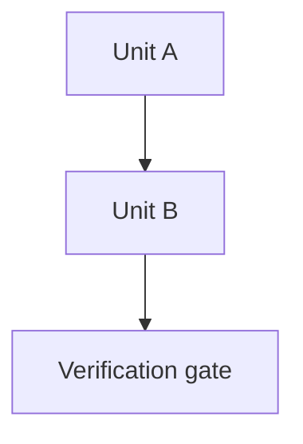

Rendering notes:

- Use the full Mermaid ESM bundle when a visual artifact may use mindmap or architecture diagrams. Mermaid Tiny does not support every diagram family.
- Keep `securityLevel: "strict"` unless the artifact has a justified need for looser HTML or click behavior.
- For dynamic content inserted after page load, Mermaid docs prefer `mermaid.run()`; `mermaid.init()` is deprecated.
- Center rendered Mermaid output inside the diagram viewport. Allow the SVG to grow and scroll when zoomed; do not force `max-width: 100%` if it makes labels unreadable.
- Use the standard `-`, `+`, and `Reset` controls for diagrams that need inspection. The text alternative must remain understandable without zoom.
- Mermaid labels can break on special characters. Quote labels with `["..."]` or use entity codes when needed.
- Avoid lowercase `end` as a flowchart node label. It can terminate a subgraph.
- Avoid node IDs or labels that start with ambiguous edge markers such as lowercase `o` or `x` after an edge unless quoted.
- Keep labels short. Put evidence, owner, confidence, and status in adjacent tables.
- Mermaid styling is most reliable with Mermaid `classDef` rules inside the diagram source. External CSS often loses to Mermaid's generated SVG styles.

## Default Diagram Types

Use these first unless a more specialized diagram matches the reader job better.

### Flowchart

Use for process, branching, dependencies, and small structural graphs.

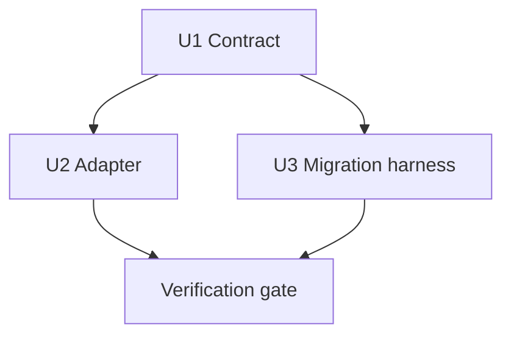

Gotchas:

- Prefer `TD`/`TB` for non-trivial diagrams; use `LR` only for short linear flows.
- Quote labels with punctuation, brackets, slashes, or long text.
- Use tables for details once the graph exceeds roughly 10 to 12 meaningful nodes.

Docs: https://mermaid.js.org/syntax/flowchart.html

### Sequence Diagram

Use when temporal interaction between a few actors matters.

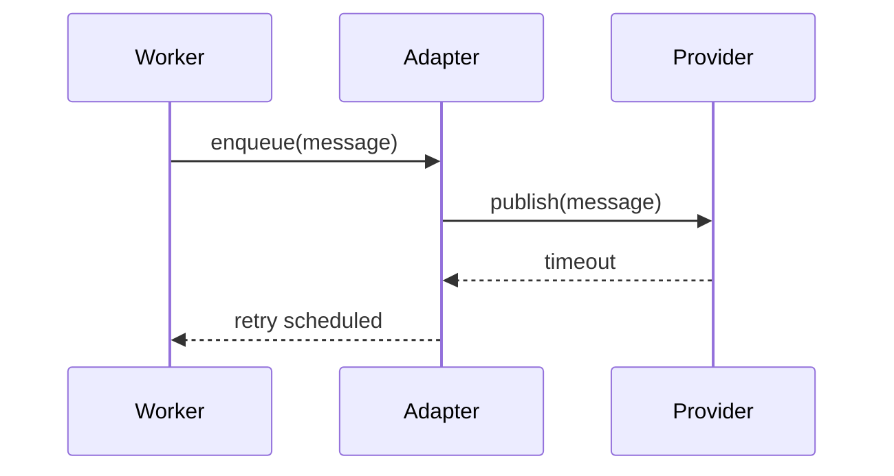

Gotchas:

- Use for time/order, not ownership matrices or dense evidence.
- Keep participant count low.

Docs: https://mermaid.js.org/syntax/sequenceDiagram.html

### State Diagram

Use for lifecycle, modes, retries, and allowed transitions. Prefer `stateDiagram-v2`.

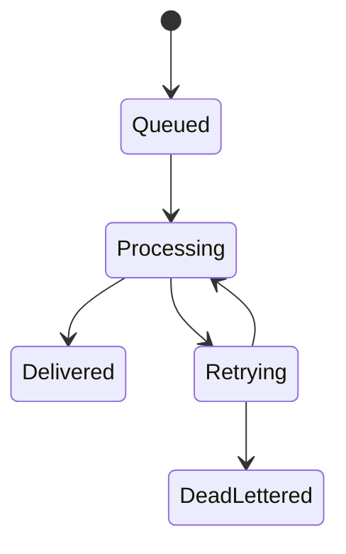

Gotchas:

- State diagrams show allowed transitions, not every side effect.
- Guards and evidence belong in a table when they get dense.

Docs: https://mermaid.js.org/syntax/stateDiagram.html

### Class Diagram

Use for type shape, inheritance, interface relationships, and structural model relationships.

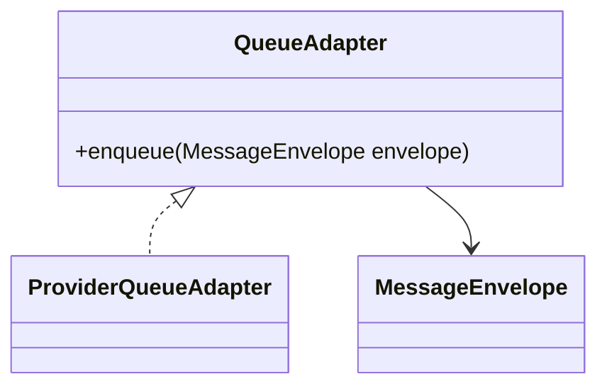

Gotchas:

- Use for structure, not runtime message order.
- Avoid dumping full class bodies; show only fields or methods relevant to the reader job.

Docs: https://mermaid.js.org/syntax/classDiagram.html

### Gantt

Use only when dates, durations, or calendar sequence are the reader question.

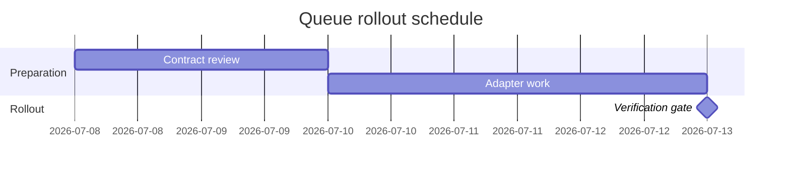

Gotchas:

- Do not use Gantt for dependency-rich implementation plans unless time is actually the question.
- Use execution waves or dependency graphs when ordering matters more than dates.

Docs: https://mermaid.js.org/syntax/gantt.html

### Pie Chart

Use for coarse part-to-whole proportions.

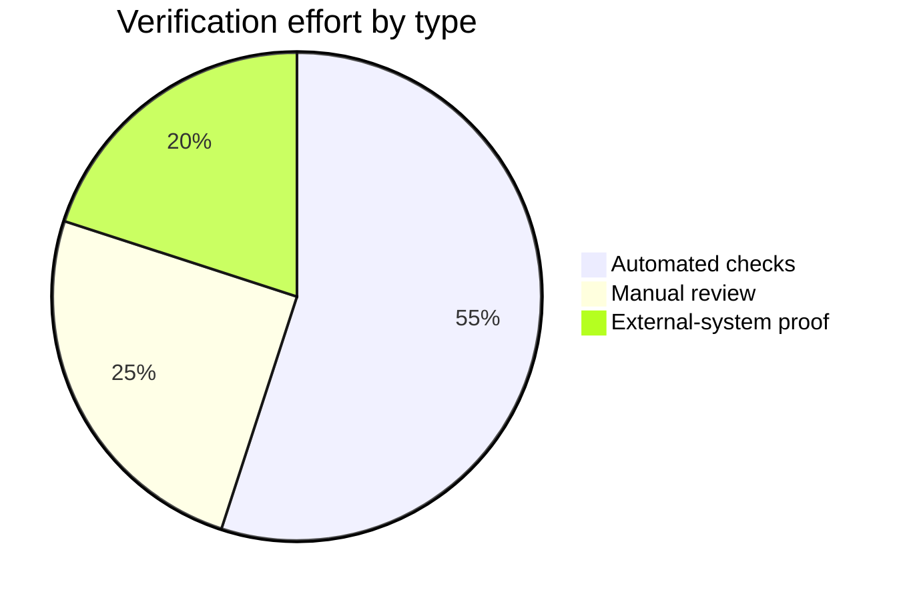

Gotchas:

- Do not use for precise comparison or many categories.
- Values need source evidence or a clear assumption label.

Docs: https://mermaid.js.org/syntax/pie.html

### Git Graph

Use for branch and merge shape.

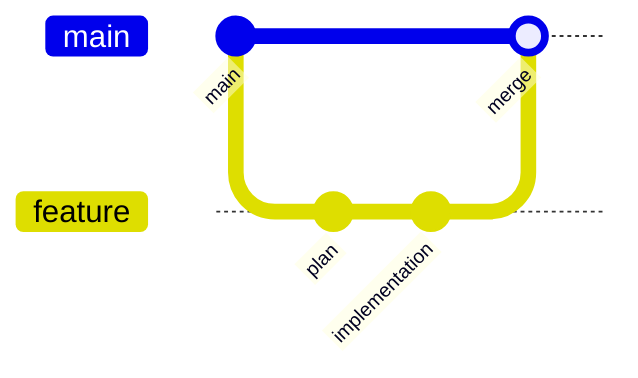

Gotchas:

- Use for git history shape, not for implementation dependency graphs.

Docs: https://mermaid.js.org/syntax/gitgraph.html

### User Journey

Use for product/user experience steps with satisfaction or friction scoring.

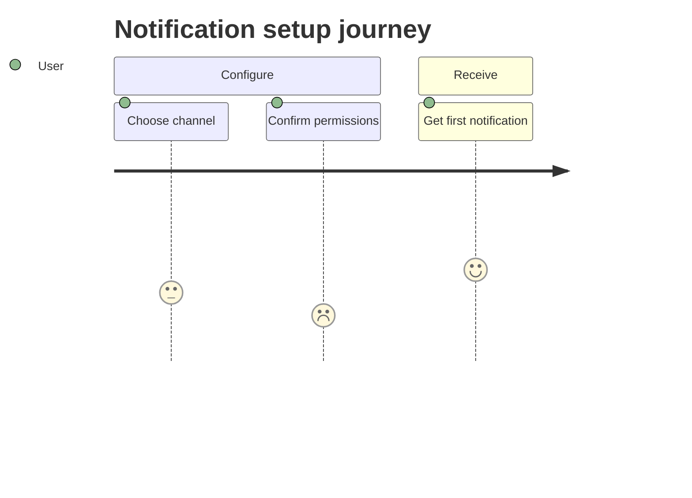

Gotchas:

- Scores are normally 1 to 5.
- Use for experience framing, not implementation flow.

Docs: https://mermaid.js.org/syntax/userJourney.html

### Quadrant Chart

Use for two-axis relative placement.

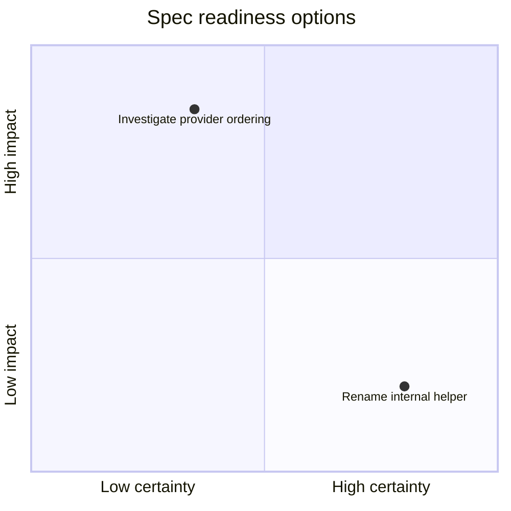

Gotchas:

- Good for prioritization or trade-off maps, not causal relationships.
- Axis meaning must be explicit.

Docs: https://mermaid.js.org/syntax/quadrantChart.html

### Mindmap

Use for hierarchical brainstorms, discovery trees, and nested unknowns.

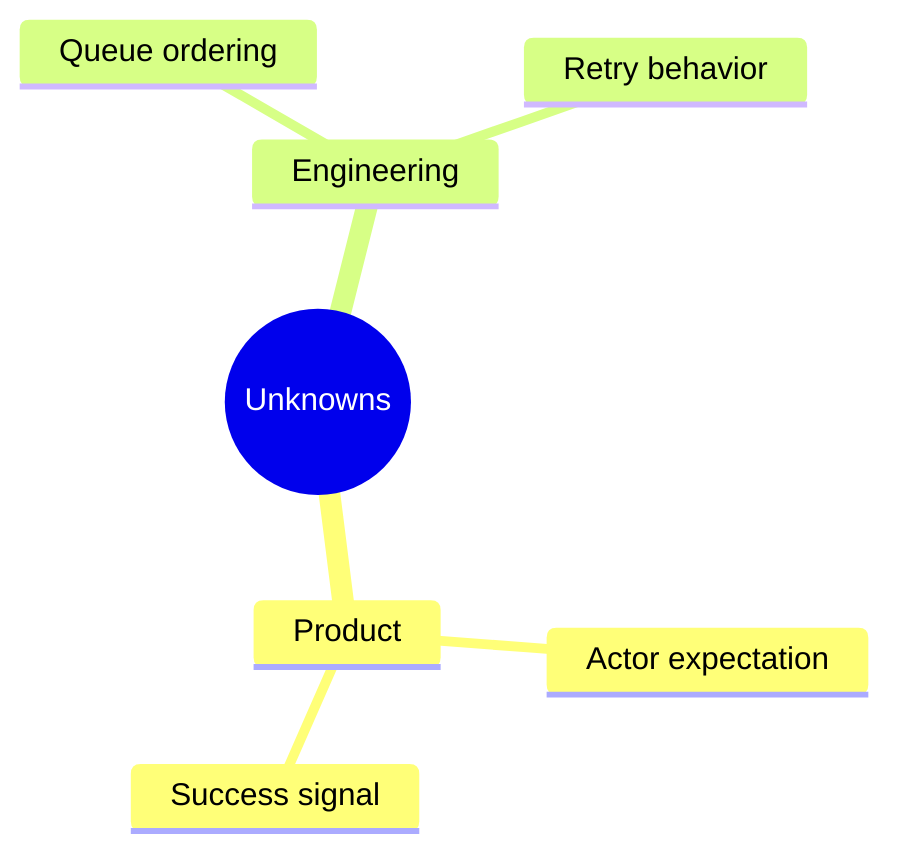

Gotchas:

- Indentation is meaningful and relative to the previous row.
- Do not use when source evidence or status comparison is the main question.

Docs: https://mermaid.js.org/syntax/mindmap.html

## Specialized Diagram Types

Use these only when the reader job directly matches the diagram's structure.

### Requirement Diagram

Use for requirement and verification traceability.

```mermaid
requirementDiagram
  requirement req_queue_ordering {
    id: REQ-1
    text: Messages preserve ordering within one recipient stream.
    risk: high
    verifymethod: test
  }
  test ordering_test {
    id: E1
    name: Worker ordering integration test
  }
  ordering_test - verifies -> req_queue_ordering
```

Gotchas:

- Useful for traceability, not for process flow.
- Keep requirement IDs aligned with the source artifact.

Docs: https://mermaid.js.org/syntax/requirementDiagram.html

### ZenUML

Use for compact call-style sequence narration when ordinary `sequenceDiagram` is too verbose.

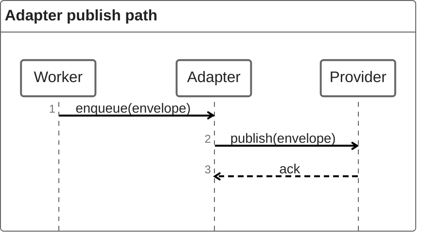

Gotchas:

- Syntax differs from Mermaid sequence diagrams.
- Use only when its compact call style is useful.

Docs: https://mermaid.js.org/syntax/zenuml.html

## Newer, Beta, Or Experimental Diagram Types

These are documented by Mermaid but should be opt-in for visual artifacts. Use them only when their structure clearly fits the reader job and the artifact can tolerate syntax or rendering differences across Mermaid versions.

### Swimlanes

Use for ownership and handoffs across lanes.

```mermaid
swimlane-beta LR
  subgraph Product
    prd[Clarify product rule]
  end
  subgraph Engineering
    spec[Write engineering spec]
  end
  prd --> spec
```

Gotchas:

- `swimlane-beta` syntax may evolve.
- Top-level `subgraph` blocks become lanes.

Docs: https://mermaid.js.org/syntax/swimlanes.html

### Timeline

Use for chronology and event order.

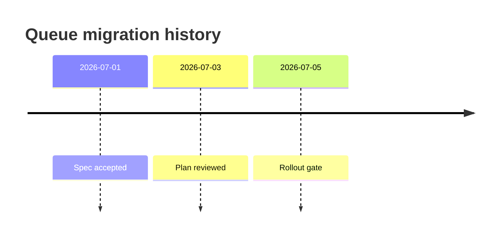

Gotchas:

- Mermaid docs call timeline experimental; icon integration is explicitly experimental.
- Use timeline only when time order is the point.

Docs: https://mermaid.js.org/syntax/timeline.html

### Entity Relationship Diagram

Use for entity relationships when a lightweight data model view is enough.

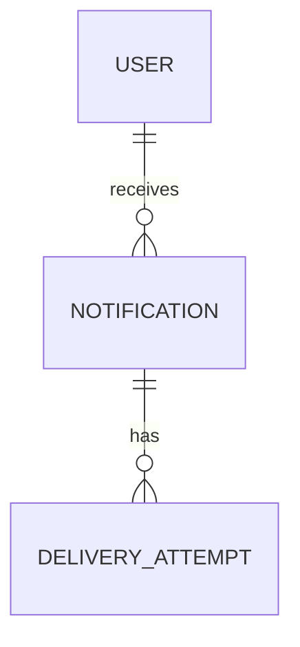

Gotchas:

- Mermaid docs explicitly mark ER diagrams as experimental.
- Use database-design or source schema artifacts for canonical database truth.

Docs: https://mermaid.js.org/syntax/entityRelationshipDiagram.html

### C4 Diagram Family

Use for C4-style context, container, component, dynamic, or deployment views when C4 notation is the actual reader job.

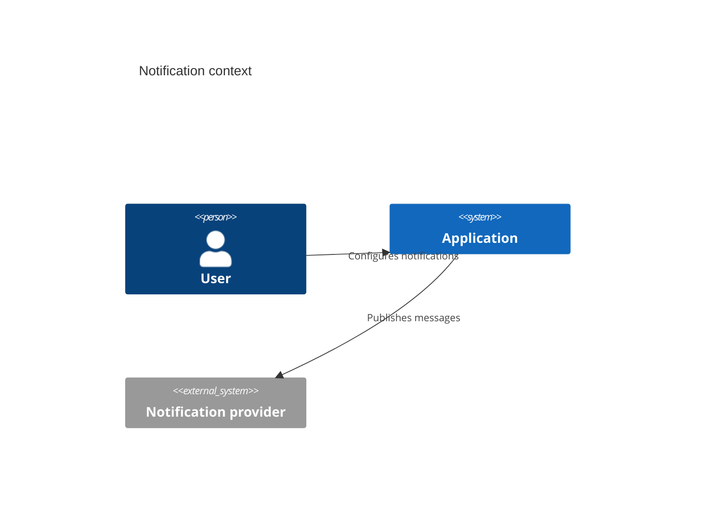

Gotchas:

- Mermaid docs explicitly mark C4 support as experimental.
- C4 has multiple forms: `C4Context`, `C4Container`, `C4Component`, `C4Dynamic`, and `C4Deployment`.

Docs: https://mermaid.js.org/syntax/c4.html

### XY Chart

Use for simple bars or lines on X/Y axes.

```mermaid
xychart-beta
  title "Queue lag by hour"
  x-axis [09:00, 10:00, 11:00]
  y-axis "Lag" 0 --> 100
  line [20, 45, 30]
```

Gotchas:

- Mermaid docs are inconsistent between `xychart-beta` and `xychart`; prefer `xychart-beta` until the target Mermaid version is pinned and verified.
- Do not use for complex analytics.

Docs: https://mermaid.js.org/syntax/xyChart.html

### Radar

Use for multi-axis relative comparison.

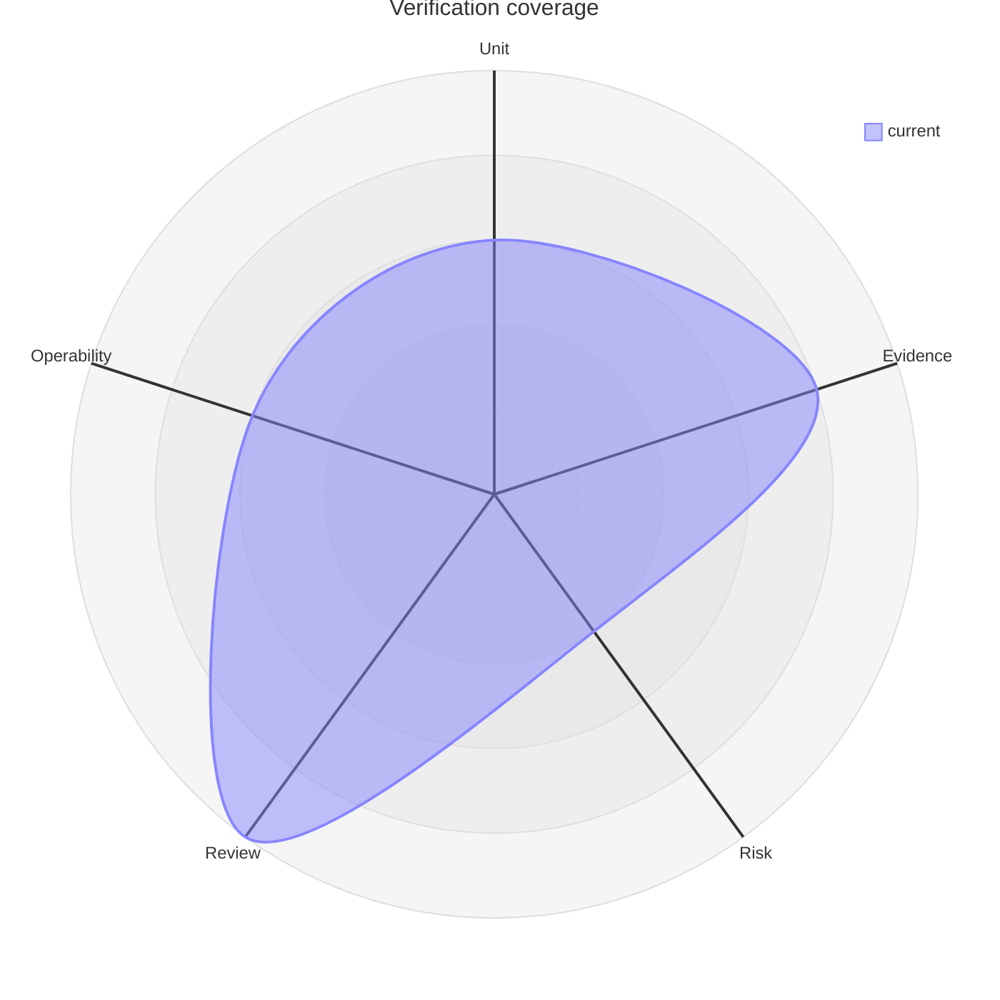

Gotchas:

- Beta syntax.
- Good for rough shape, not exact proof.

Docs: https://mermaid.js.org/syntax/radar.html

### Block Diagram

Use for manually arranged structural blocks when flowchart auto-layout is not clear enough.

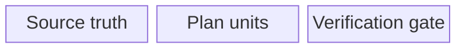

Gotchas:

- Author controls placement more directly; that makes layout responsibility higher.
- Use sparingly for clear high-level structure.

Docs: https://mermaid.js.org/syntax/block.html

### Packet Diagram

Use for packet or bit-field layouts.

```mermaid
packet
  0-15: "Source Port"
  16-31: "Destination Port"
```

Gotchas:

- Range syntax matters; Mermaid also supports bit-count notation such as `+N`.
- Use only when bit layout is the reader question.

Docs: https://mermaid.js.org/syntax/packet.html

### Kanban

Use for lightweight workflow columns and task status.

```mermaid
kanban
  Todo
    [Clarify ordering rule]
  Doing
    [Write adapter]
  Done
    [Approve spec]
```

Gotchas:

- Newer diagram type.
- Do not use as the implementation plan source of truth.

Docs: https://mermaid.js.org/syntax/kanban.html

### Architecture

Use for service/resource topology when Mermaid's architecture syntax is the best fit.

```mermaid
architecture-beta
  group app(cloud)[Application]
  service api(server)[API] in app
  service queue(queue)[Queue] in app
  api:R -- L:queue
```

Gotchas:

- Newer diagram type with `group`, `service`, `junction`, and `align` directives.
- Layout is not fully automatic; verify render before delivery.

Docs: https://mermaid.js.org/syntax/architecture.html

### Sankey

Use for weighted flow between categories.

```mermaid
sankey
  automated checks,accepted,18
  manual review,accepted,4
  manual review,blocked,2
```

Gotchas:

- Mermaid docs call Sankey experimental.
- CSV-like rows require exactly source, target, and value.

Docs: https://mermaid.js.org/syntax/sankey.html

### Event Modeling

Use for event-driven modeling across timeframes, commands, events, and views.

```mermaid
eventmodeling
  tf 01 ui NotificationForm
  tf 02 cmd SavePreference
  tf 03 evt PreferenceSaved
```

Gotchas:

- Timeframe numbers matter.
- Compact and relaxed forms both exist; namespaces create extra lanes.

Docs: https://mermaid.js.org/syntax/eventmodeling.html

### Treemap

Use for hierarchical part-to-size views.

```mermaid
treemap-beta
  "Verification work"
    "Automated": 55
    "Manual": 25
    "External": 20
```

Gotchas:

- Beta syntax.
- Good for hierarchy plus size, not flow or dependency.

Docs: https://mermaid.js.org/syntax/treemap.html

### Venn

Use for set overlap.

```mermaid
venn-beta
  set Spec["Spec truth"]
  set Plan["Plan truth"]
  union Spec,Plan["Planning handoff"]
```

Gotchas:

- Declare sets before unions.
- Labels can be separate from IDs.

Docs: https://mermaid.js.org/syntax/venn.html

### Ishikawa

Use for cause-and-effect grouping.

```mermaid
ishikawa-beta
  Failed rollout
    Process
      Missing stop gate
    System
      Queue ordering drift
```

Gotchas:

- Beta syntax.
- Use for root-cause grouping, not general hierarchy.

Docs: https://mermaid.js.org/syntax/ishikawa.html

### Wardley

Use for strategic value-chain and evolution maps.

```mermaid
wardley-beta
  title Notification capability map
  anchor User [0.95, 0.65]
  component Reliable delivery [0.75, 0.55]
  component Queue provider [0.35, 0.42]
```

Gotchas:

- Coordinates are `[visibility, evolution]`, not ordinary X/Y.
- Beta syntax.

Docs: https://mermaid.js.org/syntax/wardley.html

### Cynefin

Use for classifying decisions by complexity domain.

```mermaid
cynefin-beta
  clear
    "Known formatter rule"
  complicated
    "Adapter boundary choice"
  complex
    "User trust impact"
```

Gotchas:

- Uses fixed domain keywords.
- Self-loops are ignored; confusion domain is intentionally small.

Docs: https://mermaid.js.org/syntax/cynefin.html

### TreeView

Use for hierarchy or file-tree-style structure.

```mermaid
treeView-beta
  "visual-artifact"
    "SKILL.md"
    "references"
      "diagram-selection.md"
      "mermaid-diagrams.md"
```

Gotchas:

- Indentation is meaningful and relative to the previous row.
- Beta/newer syntax; verify render before delivery.

Docs: https://mermaid.js.org/syntax/treeView.html

## Diagram Selection Cheatsheet

| Reader question | Prefer |
| --- | --- |
| What depends on what? | `flowchart TD` dependency graph |
| Who talks to whom over time? | `sequenceDiagram` |
| What states are allowed? | `stateDiagram-v2` |
| What type/interface relationships matter? | `classDiagram` |
| What happens by date or duration? | `gantt` |
| What branch/merge shape happened? | `gitGraph` |
| What is the user's step-by-step experience? | `journey` |
| How do options compare on two axes? | `quadrantChart` |
| What broad hierarchy should we explore? | `mindmap` |
| What requirement maps to what verification? | `requirementDiagram` plus trace table |
| Who owns each handoff? | `swimlane-beta` only when lanes are central; otherwise an owner matrix |
| What system context or container view matters? | `C4Context`/`C4Container` only when C4 is accepted; otherwise `flowchart` plus table |
| What is the topology? | `architecture-beta` only when verified; otherwise compact `flowchart` |
| What changed over time? | `timeline` when chronology is central; otherwise a table |
| What evidence proves a claim? | Table or evidence rail, not Mermaid |
